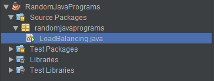
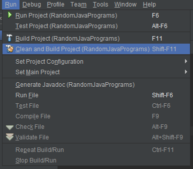
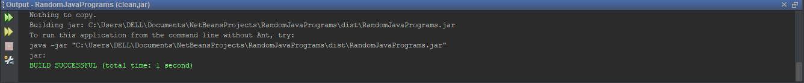

# Java-JAR-EXE conversion (WIP)
- ## Converting from Java to JAR file
  - Download [NetBeans 8.2 with JDK](https://www.oracle.com/technetwork/java/javase/downloads/jdk-netbeans-jsp-3413139-esa.html)
  - Install Netbeans
  - Create a new project or open an existing project
  - It will generate a structure as shown in the following figure  
    
  - Open the file containing the main method (In my case it is LoadBalancing.java)
  - In the Run Tab, select the option "Clean and Build Project"  
    
  - It will generate the jar file and in the Output, it will show the path of the jar file (Refer the below figure)
    
  - The jar file for the project is created successfully!
  
